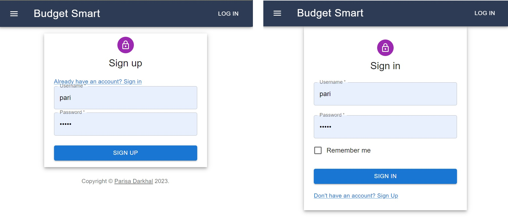
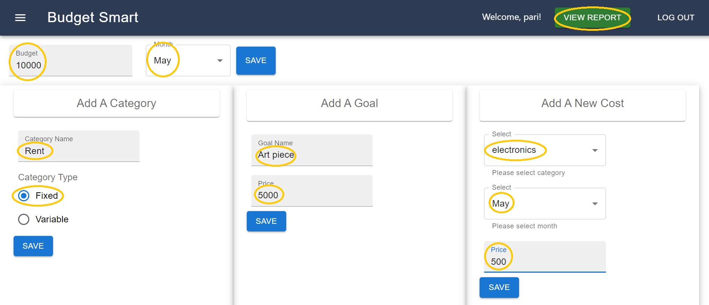
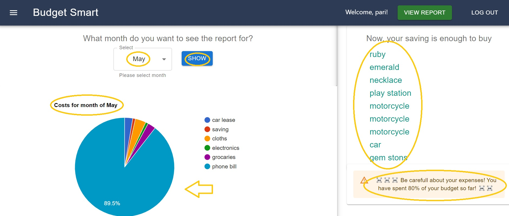

# Budget Smart - Expense Tracking and Goal Management Web Application

Budget Smart is a web application designed to help users keep track of their expenses, control their budget, and achieve their financial goals. The project was developed as a means to improve skills in working with various technologies such as MYSQL, Sequelize, React, Material UI, Axios, React Google Charts, and React Toastify.

## Features

- User Sign Up and Login: New users can create an account by signing up and existing users can log into their accounts securely.

- Dashboard: Upon logging in, each user is presented with a personalized dashboard that includes the following features:

  1. Budget Tracking: Users can enter and save their budget for each month.
  2. Cost Categories: Users can define and save categories for their expenses (e.g., groceries, rent, etc.).
  3. Goals: Users can add and save their financial goals along with their respective prices.
  4. Expenses: Users can add each cost based on the category, month, and price, and store this data in the database using MYSQL and Sequelize.

- Report Page: The "View Report" button in the navigation bar directs users to the report page, where they can access the following information:
  1. Monthly Expense Breakdown: A pie chart displays the costs and their percentages based on the chosen month. Users can hover over each segment to view the exact amount spent for that category.
  2. Goal Progress: Users can check their savings and compare them with their goal prices, giving them an idea of which goals are achievable with their current savings.
  3. Expense Alert: An alert is shown only when the user's expenditure exceeds 80% of their monthly budget, helping them stay on track with their spending.

## Technologies Used

### Backend

- Node.js
- Express.js
- MYSQL
- Sequelize
- Bcrypt

### Frontend

- React
- Material UI
- Axios
- React Google Charts
- React Toastify

## Screenshots and Video

[Link to Video](https://example.com) - A video showcasing the functionalities of the Budget Smart web application.

### Screenshots

1. Registration
   

2. Dashboard
   

3. Report Page
   

## Getting Started

To run the Budget Smart web application on your local machine, follow these steps:

1. Clone the repository: `git clone https://github.com/parisadarkhal/budget-smart.git`
2. Navigate to the project folder: `cd budget-smart/backend`
3. Install backend dependencies: `npm install`
4. `cd ..`
5. Install frontend dependencies: `cd frontend && npm install`
6. Start the backend server: `cd backend node server.js `
7. Start the frontend development server: `cd frontend npm start`

## Contribution

Contributions to the Budget Smart project are welcome. If you find any issues or have suggestions for improvements, please create a new issue or submit a pull request.

## License

The Budget Smart project is open-source and available under the [MIT License](https://opensource.org/licenses/MIT). Feel free to use, modify, and distribute the code according to the terms of this license.
